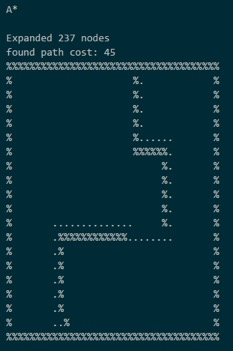
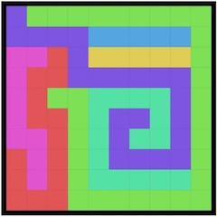
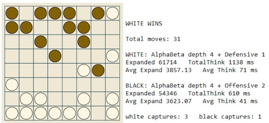
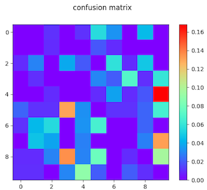
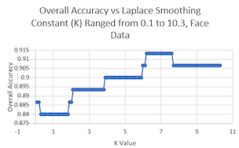
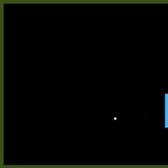
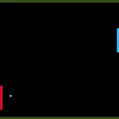

### UIUC AI Intro Fall 2017

Search

Constraint Satisfaction

Classification

Reinforcement Learning

https://www.youtube.com/playlist?list=PLohwl-IIrRMUOZ35qeo3C3XKFyJ5jwRci

> Artificial retards: 人工智障
