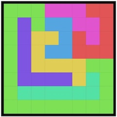
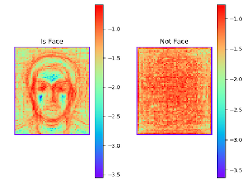
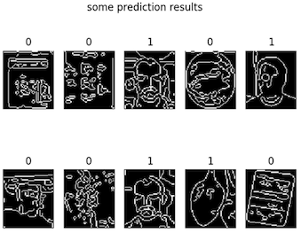
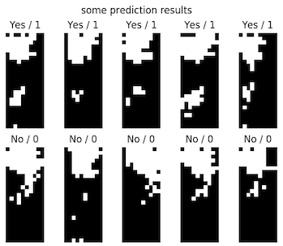
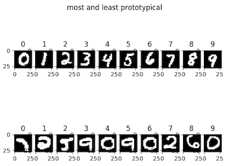

### UIUC AI Intro Fall 2017

Search

Constraint Satisfaction

Classification

Reinforcement Learning

https://www.youtube.com/playlist?list=PLohwl-IIrRMUOZ35qeo3C3XKFyJ5jwRci

<iframe src="https://giphy.com/embed/3o6fJ6txMX9Hmkgp5C" width="480" height="480" frameBorder="0" class="giphy-embed" allowFullScreen></iframe>

<iframe src="https://giphy.com/embed/l3mZdcimp6kzUOIjC" width="480" height="480" frameBorder="0" class="giphy-embed" allowFullScreen></iframe>

> Artificial retards: 人工智障
