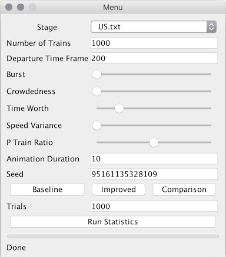
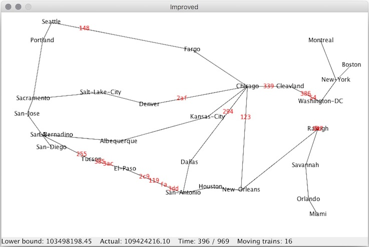

Report: project-report/report.pdf

Slides: Train Project Presentation.pdf

### How to Run

Open the runnable jar `bin/TrainDispatch.jar`, just add water. Enjoy.

### How to Play

What are all these buttons and knobs?

Name | Explanation
------ | ------
Stage | choose a built-in railway map to run on
Number of Trains | how many trains to be scheduled
Departure Time Frame | the time frame for the departure time of the trains
Burst | increases the number of trains departing at the same time
Crowdedness | increases the number of trains departing from the same initial station
Time Worth | increases the worth of time when calculating cost
Speed Variance | how differed the speeds of the trains are
P Train Ratio | the ratio of passenger trains
Animation Duration | how long do you wish the animation to last in seconds (guaranteed lower bound)
Seed | a seed for the random schedule generator
Trials | for Run Statistics only. The number of trials to perform
(A horizontal bar) | this is the progress bar
Done | this is the status indicator

Buttons:

Name | Function
-----|-----
Baseline | using the given parameters, run a single simulation with baseline strategy, then animate
Improved | using the given parameters, run a single simulation with improved strategy, then animate
Comparison | using the given parameters, run a single simulation with the baseline and improved strategies, then animate at the same time
Run Statistics | using the given parameters (except that the generator is seeded with System.nanotTime() for each trial.), run the specified number of trials and produce output file in the current directory.